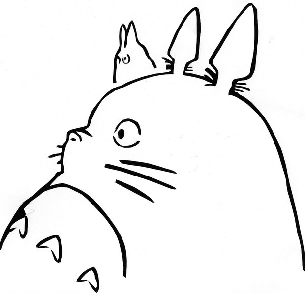

# Resume

|key|value|
|---|---|
|Name|Daisaku Hayashi|
|Grade|M2|
|Twitter|[@cherrybachelor](https://twitter.com/cherrybachelor)|
|GitHub|[dainnovation722](https://github.com/dainnovation722)|
|Contact|722.dai.innovation@gmail.com|

## Affilication

[Funatsu & Kotera Lab.](http://funatsu.t.u-tokyo.ac.jp/en/home/)  
[Chemical System Engineering](http://www.chemsys.t.u-tokyo.ac.jp/?lang=en)  
The University of Tokyo  
 
I'm M2 in Department of Chemical System Engineering in the University of Tokyo.  
My research is to develop time-series regression model (soft sensor).

## Expertise Area
- Machine Learning
  - Time-Series Prediction
  - Transfer Learning
  - Anormaly Detection
- Chemical Engineering 
  - Fluid Simulation 
  - Mixing(static mixer)

## Skill
- C++
- Python 
  - Django
  - tensorflow
  - pytorch
- SQL
- HTML
- CSS
- Git
- OpenFOAM
- RFLOW

## Intern
|Period|Company|Description|
|---|---|---|
|2019.5 ~ 2019.11|[Metadata](https://metadata.co.jp/)|• Development for BtoB web application   • Mathematical optimization technique   • Web API|
|2019.9 |[Albert](https://www.albert2005.co.jp/)|• Development for Reversible Game AI by reinforcement learning|
|2019.9 ~ Now|[Matsuo Lab.](https://weblab.t.u-tokyo.ac.jp/) [NABLAS](https://nablas.com/)| • Anormaly detection for batch time-series data in chemical plant   

## Github Repository
|Repository|type|Description|
|---|---|---|
|[Transfer Learning for Time-Series Regression](https://github.com/dainnovation722/transfer-learning-LSTM)|Research|I research regression model for time-series data by transfer learning and index dataset which is useful when we choose dataset as source dataset.|
